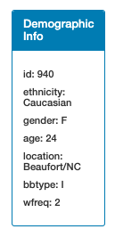

# Project: Belly Button Biodiversity

## Objective:
Build an interactive dashboard to explore the [Belly Button Biodiversity dataset](http://robdunnlab.com/projects/belly-button-biodiversity/), which catalogs the microbes that colonize human navels.

## Tools:
* Javascript
* D3 library
* Plotly library
* HTML
* CSS 

## Assignment:
* Read in json dataset
* Create horizontal bar chart with dropdown menu to display top 10 OTU's found in individual

* Create bubble chart that displays each sample

* Display the sample metadata, i.e., an individual's demographic information
* Display each key-value pair from the metadata JSON object somewhere on the page

* Update all of the plots any time that a new sample is selected

## Website Link:
https://janejanejam.github.io/plotly-challenge/